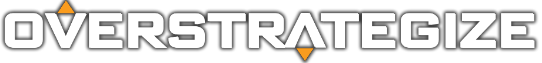

## Inspiration
Overwatch is a game developed and published by Blizzard Entertainment Inc. in 2016. With the anticipation of Overwatch 2 around the corner, there has been an influx of new players just starting to pick up the game.

Due to the fact that Overwatch is a competitive game, there are many different players of varying skill levels and experiences in the game. For new players, it may be daunting to start learning about hero synergies and how to optimize their strategies to win games.

So, Overstrategize is born!

## What is it
Overstrategize is a tool built for Overwatch players by Overwatch players who want to climb the ranks with better strategic hero picks - no cheats, no aimbots. 

Overstrategize's mission is to help fellow Overwatch players, who are struggling to climb out of their current ranks, make better strategic decisions.

Using machine learning technologies, Overstrategize incorporates a real-time object detection algorithms to analyze both the ally and enemy teams, then determine the best hero the player should select based on the current map and hero composition.

## How we built it

Using the hero and map synergy data we collected from various sources in the Overwatch community, we built a custom machine learning model using Google AutoML Object Detection API to detect the player's team composition when playing the game.

The tool then will recommend the best hero for a player based on the current map and team composition.

Overstrategize is available as an online web tool or as a downloadable desktop app. The website is built with React and Chakra UI, and the desktop app is built with Python.

### Technologies Used

## How To Use
Visit the Overstrategize [website](https://overstrategize.herokuapp.com/) to use the tool online or download the desktop app.

### Using the Online Tool
1. Enter the information in the **Main** tab.

2. Click the "Recommend" button to calculate. The result will be displayed in the **Result** tab.

Here's how to interpret the result:
- If your team's total points is higher than the enemy team's, your team has the advantage and vice versa.
- Under the **Results Breakdown** section, you can see the breakdown of each hero synergy from both your team's or the enemy team's perspective.
- **Tier points** are the synergy points of the hero in the tier. The higher the tier points on the hero, the more advantageous to pick this hero in the specified tier.
- **Map points** are the synergy points of the hero in the map. The higher the map points on the hero, the more advantageous to pick this hero in the specified map. If it is 0, then it means the hero has neutral advantage on the map.
- **Hero Synergy** refers to the amount of synergy the hero has with the team. The higher the hero synergy, the more advantageous to pick this hero for this team composition.
- **Hero Counter** refers to how good this hero is at countering the enemy team's heroes. The higher the hero counter, the more advantageous to pick this hero for this team composition.

3. After viewing the results, you can navigate to the **Recommendation** tab to see the recommended heroes.

Here's how to interpret the result:
- The **Recommendation** tab shows the recommended heroes for your team by the roles: Tank, Damage and Support.
- Under each role, you can see the recommended heroes for that role. The most recommended heroes are at the top of the list. Their total synergy points is shown next to their picture.

### Using the Desktop App
1. Download the app from the 

------------

## Disclaimer
Overstrategize DO NOT OWN anything related to Overwatch. This tool is completely free, does not seek to interfere with the original license, and offered for the sole purpose of helping players become better. But in case of request from Blizzard Entertainment Inc., the development of the tool can stop at any time.

Special thanks to https://www.overpicker.win/ and https://heropicker.com/ for providing the data used in the tool.

All logos, images and hero names belong to Blizzard Entertainment Inc.

All trademarks, service marks and trade names are the property of Blizzard Entertainment Inc. or its related companies. This project is for free distribution, any attempt to sale or marketing it is strictly prohibited.

All materials containing the Overwatch name are the property of Blizzard Entertainment Inc. or its related companies.