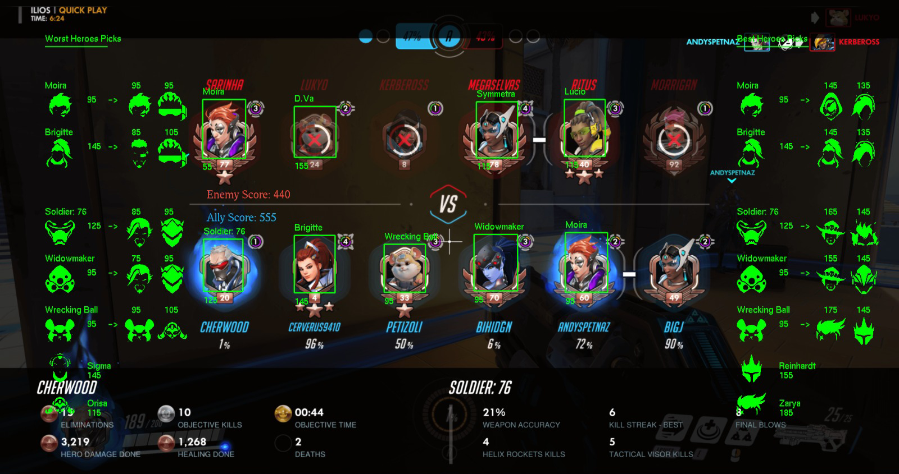

## Inspiration
Overwatch is a game developed and published by Blizzard Entertainment Inc. in 2016. With the anticipation of Overwatch 2 around the corner, there has been an influx of new players just starting to pick up the game.

Because Overwatch is a competitive game, there are many different players of varying skill levels and experiences in the game. For new players, it may be daunting to start learning about hero synergies and how to optimize their strategies to win games.

We started playing Overwatch in 2020 and have been struggling to get good due to poor technical and strategic decision making skills. While it takes time to improve on our game technicals, we believe that we can create a tool to help us improve our strategizing skills.

Hence, from our new year's resolution to become better Overwatch players, Overstrategize is born!

## What is it
Overstrategize is a tool built for Overwatch players by Overwatch players who want to climb the ranks with better strategic hero picks - no cheats, no aimbots. 

Overstrategize's mission is to help fellow Overwatch players, who are struggling to climb out of their current ranks, make better strategic decisions.

Using machine learning technologies, Overstrategize incorporates real-time object detection algorithms to analyze both the ally and enemy teams, then determine the best hero the player should select based on the current map and hero composition.

## How we built it

Using the hero and map synergy data we collected from various sources in the Overwatch community, we built a custom machine learning model using Google AutoML Object Detection API to detect the player's team composition when playing the game.

The tool then will recommend the best hero for a player based on the current map and team composition.

Overstrategize is available as an online web tool or as a downloadable desktop app. The website is built with React and Chakra UI, and the desktop app is built with Python.

> Note: This GitHub repository is the source code for the website and online tool. The desktop app is at a separate GitHub repository [here](https://github.com/steffy-lo/overstrategize).

### Technologies Used


## How To Use
Visit the Overstrategize [website](https://overstrategize.herokuapp.com/) to use the tool online or download the desktop app.

### Using the Online Tool
1. Enter the information in the **Main** tab.


2. Click the "Recommend" button to calculate. The result will be displayed in the **Result** tab.


Here's how to interpret the result:
- If your team's total points is higher than the enemy team's, your team has the advantage and vice versa.
- Under the **Results Breakdown** section, you can see the breakdown of each hero synergy from both your team's or the enemy team's perspective.
- **Tier points** are the synergy points of the hero in the tier. The higher the tier points on the hero, the more advantageous to pick this hero in the specified tier.
- **Map points** are the synergy points of the hero in the map. The higher the map points on the hero, the more advantageous to pick this hero in the specified map. If it is 0, then it means the hero has neutral advantage on the map.
- **Hero Synergy** refers to the amount of synergy the hero has with the team. The higher the hero synergy, the more advantageous to pick this hero for this team composition.
- **Hero Counter** refers to how good this hero is at countering the enemy team's heroes. The higher the hero counter, the more advantageous to pick this hero for this team composition.


3. After viewing the results, you can navigate to the **Recommendation** tab to see the recommended heroes.


Here's how to interpret the result:
- The **Recommendation** tab shows the recommended heroes for your team by the roles: Tank, Damage and Support.
- Under each role, you can see the recommended heroes for that role. The most recommended heroes are at the top of the list. Their total synergy points is shown next to their picture.


### Using the Desktop App
Unlike the online tool where you have to manually enter the team and map information, the desktop app will automatically detect the team composition and map information in real-time when you play the game.

Before you decide the use the desktop app, you should make sure you have the following:
1. Overwatch installed and you have basic knowledge of the game
2. Python 3.7 or above installed in your machine
3. Code editor software like PyCharm or Visual Studio Code
4. Some background knowledge of setting up a Python project


Note that depending on your machine's specs, the game frame rate may drop when using together with desktop app.

> **Important:** When running the game, ensure the window is set to Borderless Window instead of Fullscreen.

To start using the desktop app:
1. Download the app from the Overstrategize [website](https://overstrategize.herokuapp.com/).
2. Unzip the folder.
3. Navigate to the `requirements.txt` file and replace lines 34 and 35 with your own directory where you downloaded the folder.
```
PyOpenGL @ file:///YOUR_DIRECTORY/Overstrategize-master/wheels/PyOpenGL-3.1.5-cp38-cp38-win_amd64.whl
PyOpenGL-accelerate @ file:///YOUR_DIRECTORY/Overstrategize-master/wheels/PyOpenGL_accelerate-3.1.5-cp38-cp38-win_amd64.whl
```

For example, if the folder is located at `C:/Users/victo/Downloads/` then the lines should be:
```
PyOpenGL @ file:///C:/Users/victo/Downloads/Overstrategize-master/wheels/PyOpenGL-3.1.5-cp38-cp38-win_amd64.whl
PyOpenGL-accelerate @ file:///C:/Users/victo/Downloads/Overstrategize-master/wheels/PyOpenGL_accelerate-3.1.5-cp38-cp38-win_amd64.whl
```
4. Run `pip install -r requirements.txt` to install the dependencies.
5. Run `python main.py` to start the app.
6. Run the game and while playing, press Tab for 3 seconds to load the summary screen and the analysis results will show as an overlay on it.



How to interpret the GUI displayed on game screen:
- The left column shows the worst heroes for your team based on the roles (top-down): Support, Damage and Tank.
- The left column shows the best heroes for your team based on the roles (top-down): Support, Damage and Tank.
- The numbers next to each hero shows the total synergy points of the hero. Swap to a hero that has a higher point for optimal team strategy.


## Challenges We Ran Into

We have attempted to build this project back in May-June 2021. We have tirelessly included over 2000 different data sets from various sources to build the object detection model for the app. But after that, we encountered a lot of difficulties building the desktop app to run with the game and provide recommendations in real-time. So our dream to complete this app was put on hold until this hackathon started.

Since this is a new year hackathon, we decided to return to this forgotten project and gave it another chance. Completing this tool at the start of the new year would help us fulfill our new year's resolution to get better at the game. At the same time, completing this project would signify that we have overcome the challenges we faced in the past, and grew as hackers.

#### What we worked on during the hackathon weekend:
- Continued to work on the unfinished desktop app
- Added more data sets to the object detection model
- Built a fully responsive website to host the desktop app for download or online use
- Made the demo video to showcase the app (both online web version and desktop app)

#### The challenges we had to overcome during the hackathon were:
- Optimizing the desktop app because it was very laggy when it was run with the game.
- It is holiday season right now so the game's servers are overloaded and down, causing a lot of frustration and hiccups when testing.
- Finding a way to make the app easy to use while playing the game.
- Using a lot of Python dependencies causes a few issues and errors during testing.
- The custom model is sometimes not able to detect the heroes correctly in the game. We quickly had to re-train with more data.
- Making the web app version of the app takes a lot of time but necessary. We want the tool to be accessible even for non-developers because right now to set up the desktop app, it may be too difficult for a person without any background knowledge in Python.
- Learning Chakra UI for the first time to style the website.

## Accomplishments We Are Proud Of
Despite all the challenges we faced during this hackathon, we are proud to be able to complete building the desktop app in the weekend of this hackathon. 

On top of that, we even managed to build an official Overstrategize website that includes the online version with all the strategy calculation algorithms that the desktop app can do.

Finally, we are proud that we had a lot of fun and learned a lot from this hackathon. After hours of coding, we felt a little experimental and made the most extra demo video we could think of. Overall, it was a fun project to unleash our creativity and learn new skills.

## What's Next for Overstrategize?
The app and website are still prototypes so there are many things we would like to improve on:
- Add more data sets to the object detection model to increase its accuracy
- Add map detection to the model so the app can detect map information in real-time
- Add more game strategy aspects such as positioning, skill rating, etc. to the app for better recommendations
- Make the desktop app as a .exe so that non-developers can also use it by just install it. No need to set up Python environment.

------------

## Disclaimer
Overstrategize DO NOT OWN anything related to Overwatch. This tool is completely free, does not seek to interfere with the original license, and offered for the sole purpose of helping players become better. But in case of request from Blizzard Entertainment Inc., the development of the tool can stop at any time.

Special thanks to https://www.overpicker.win/ and https://heropicker.com/ for providing the synergy and counter data used in the tool.

All logos, images and hero names belong to Blizzard Entertainment Inc.

All trademarks, service marks and trade names are the property of Blizzard Entertainment Inc. or its related companies. This project is for free distribution, any attempt to sale or marketing it is strictly prohibited.

All materials containing the Overwatch name are the property of Blizzard Entertainment Inc. or its related companies.